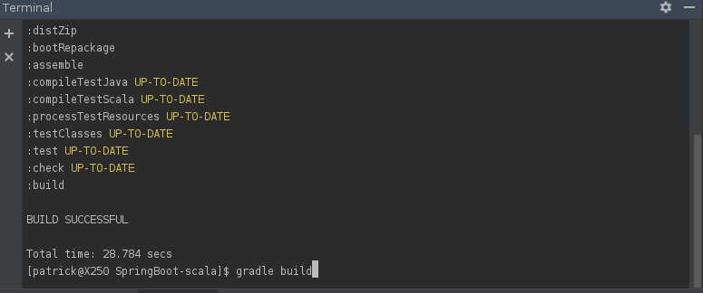
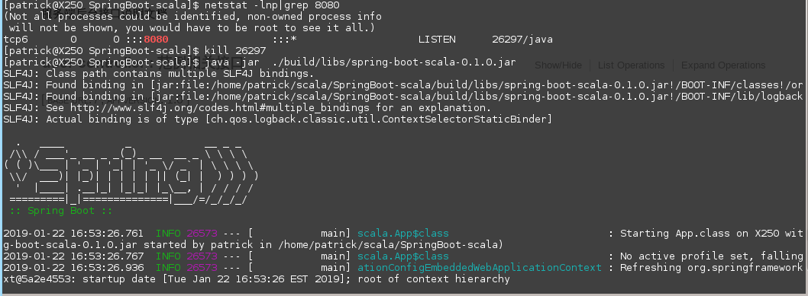
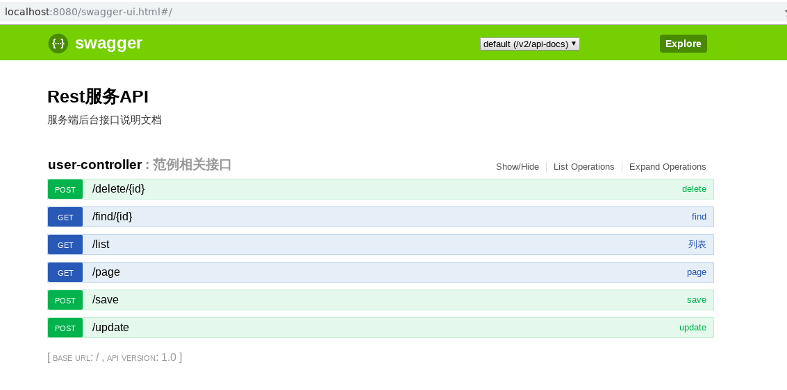

## SpringBoot-Scala
`note`
*integrate with swagger2

run `gradle build` in terminal,please don't use gradle tool for idea, it is no working base on my testing

`java -jar  ./build/libs/spring-boot-scala-0.1.0.jar`

visit `http://localhost:8080/swagger-ui.html#/`

